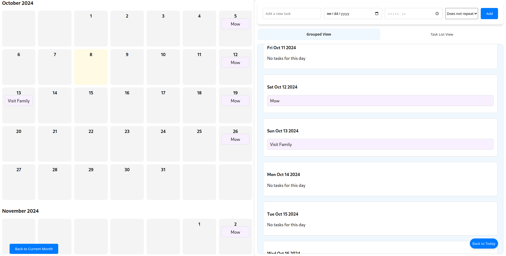

# Calendar +

Welcome to **Calendar +**, the sleek and powerful task management app designed to help you stay on top of your day-to-day activities effortlessly. This app combines an intuitive interface with a smooth experience for managing tasks, schedules, and events.




## 🎯 Table of Contents

- [Watch the Demo Video](#-watch-the-demo-video)
- [Features](#-features)
- [Installation](#-installation)
- [Contributing](#-contributing)
- [Built With](#-built-with)
- [License](#-license)
- [Why Calendar +?](#-why-calendar-)
- [Contact](#-contact)

---

## 🎥 Watch the Demo Video
Click the link below to check out the full demonstration of Calendar + on YouTube:

[Watch on YouTube](https://www.youtube.com/watch?v=xInQKBBaXbo)

---

## 📋 Features

### 🗓 Simple Task Creation
- **Add tasks** effortlessly with a single tap, assigning due dates with or without specific times.
- Option for **all-day tasks** and tasks without repeat or time constraints.

### 🔁 Repeatable Tasks
- Set up **recurring tasks** that repeat daily, weekly, or at custom intervals.
- Visualize repeating tasks on both the **task list view** and the **calendar view**.

### 📅 Calendar & Task Views
- Switch seamlessly between **grouped view** and **task list view**.
- **Infinite scrolling** in both task and calendar views, allowing you to browse past and future tasks without limits.

### ⏳ Navigation Tools
- Jump back to the **current day** or **current month** with one tap.
- Scroll within individual days on the calendar if there are too many tasks.

### 📝 Task Editing & Management
- Edit tasks easily by clicking on them and updating details like **start date** or **recurrence**.
- Quickly delete tasks when they’re no longer needed.

---

## 💻 Installation

1. Clone the repository:

    ```bash
    git clone https://github.com/YourGitHubProfile/calendar-plus.git
    ```

2. Navigate to the project directory:

    ```bash
    cd calendar-plus
    ```

3. Install dependencies:

    ```bash
    npm install
    ```

4. Start the development server:

    ```bash
    npm start
    ```

Your app should now be running on `http://localhost:3000`.

---

## 🤝 Contributing

Contributions are welcome! Here's how you can contribute:

1. Fork the repository.
2. Create a new feature branch (`git checkout -b feature/AmazingFeature`).
3. Commit your changes (`git commit -m 'Add some amazing feature'`).
4. Push to the branch (`git push origin feature/AmazingFeature`).
5. Open a pull request.

### Code of Conduct
Please follow the [Code of Conduct](CODE_OF_CONDUCT.md) in all your interactions with the project.

---

## 🛠️ Built With

- **React** - Frontend framework for building dynamic UI.

---

## 📄 License

This project is licensed under the MIT License - see the [LICENSE](LICENSE.md) file for details.

---

## ✨ Why Calendar +?

**Calendar +** is built for people who want **simplicity with power**. Whether you're scheduling an appointment or setting up a recurring task, this app makes it easy to manage your life with minimal effort. It’s packed with features that give you full control of your day while keeping the interface sleek and intuitive.

---

## 📲 Contact

Follow me for more projects and updates:

- GitHub: [TuckTuckC](https://github.com/TuckTuckC)
